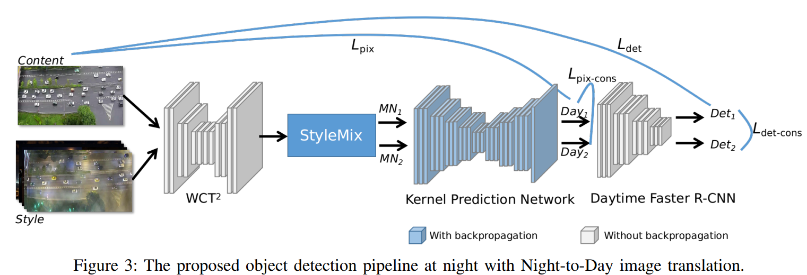
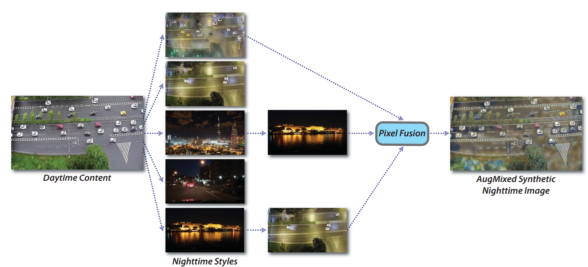
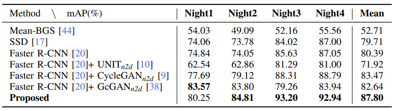

## N2D-transfer
[Paper: Let There be Light: Improved Traffic Surveillance via Detail Preserving Night-to-Day Transfer](https://ieeexplore.ieee.org/stamp/stamp.jsp?arnumber=9435348)



## [Datasets](https://drive.google.com/drive/folders/1GQYFej223oaaXycFpYryVM4TrNUIwvZ9?usp=sharing)
  include 1000 daytime images, 1000 nighttime images(night1, night2, night3, night4, each has 250 images.)

## Requirements
  ```shell
  Python 3.7.3
  pyTorch 1.0.0
  ```
## Train
1. For style augmentation, first aug all permutations first. Data is organized as following:

```shell
--Style
--Day
```
  Run the code `./transfer.sh` for style augmentation. Output will be stored in `./datasets/Cars_aug`.

2. N2D transfer, run the code `./train.sh`, where `sample_path` is the dataset path.
  * Style mix framework:
  
  * Night to day image translation vis results:
  
3. Detection evaluation model: [faster_rcnn model](https://drive.google.com/file/d/1Do17QzaR4G55n51qF68qLtikGVcn7AG3/view?usp=sharing)
  * N2D translation, detection results:
  
  * after translation, detection vis results ploted on nighttime images:
  
4. Faster RCNN code is based on [faster_rcnn code](https://github.com/jwyang/faster-rcnn.pytorch/tree/pytorch-1.0), please follow the project for compiling.


## Bibtex
```
@article{fu2021auto,
      title={Let There be Light: Improved Traffic Surveillance via Detail Preserving Night-to-Day Transfer}, 
      author={Lan Fu and Hongkai Yu and Felix Juefei-Xu and Jinlong Li and Qing Guo and Song Wang},
      year={2021},
      journal={TCSVT}
}

@article{li2021domain,
  title={Domain adaptation from daytime to nighttime: A situation-sensitive vehicle detection and traffic flow parameter estimation framework},
  author={Jinlong Li and Zhigang Xu and Lan Fu and Xuesong Zhou and Hongkai Yu},
  journal={Transportation Research Part C: Emerging Technologies},
  year={2021}
}
```
## Acknowledments
* [WCT2](https://github.com/clovaai/WCT2)
* [Faster R-CNN](https://github.com/jwyang/faster-rcnn.pytorch/tree/pytorch-1.0)
